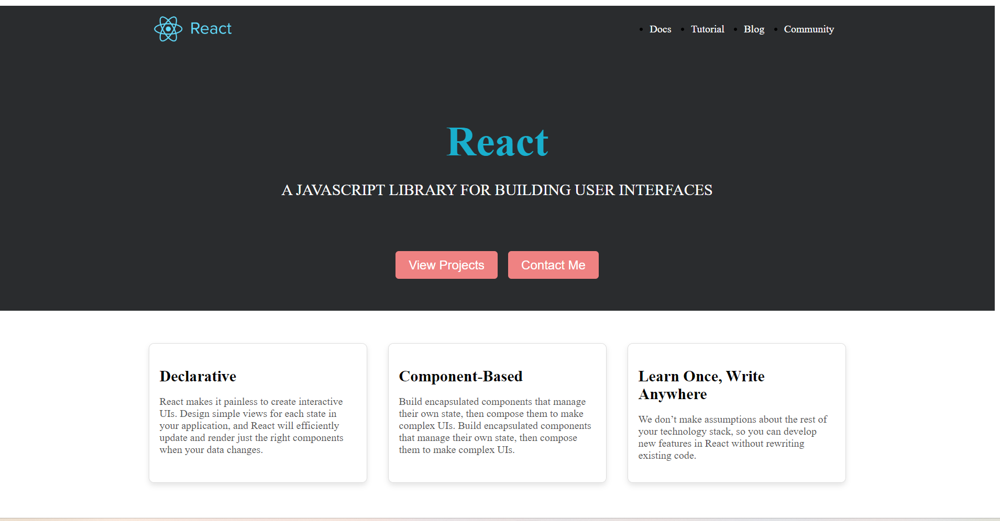

Run your React app by running command **npm run dev** in your terminal, open the website, create React webpage as shown above.


1. Download React logo above to your **src/assets** folder and name it react.png**

2. under **src/components**, create **Navbar** folder

create **Navbar.jsx**

````react
import { NavLink } from "react-router-dom";
import "./Navbar.css";
import reactLogo from "../../assets/react.png";

export default function Navbar() {
  return (
    <nav className="navbar">
      
      <ul className="navlinks">
        <li>
          <NavLink to="/">Docs</NavLink>
        </li>
        <li>
          <NavLink to="/products">Tutorial</NavLink>
        </li>
        <li>
          <NavLink to="/about">Blog</NavLink>
        </li>
        <li>
          <NavLink to="/contact">Community</NavLink>
        </li>
      </ul>
    </nav>
  );
}
````

create **Navbar.css**

````css
.navbar {
  display: flex;
  align-items: center;
  justify-content: space-between;
  background-color: #2a2c2e;
  padding: 10px 15vw;
}

.navlinks {
  display: flex;
}

.navlinks li a {
  text-decoration: none;
  color: white;
  font-size: 1rem;
}

.navlinks li {
  margin: 0 15px;
}

.navbar img {
  height: 50px;
}
````


3. under **src/components,** create **Button** folder 

   create **Button.jsx** 

   ````react
   import styles from "./Button.module.css";
   
   export default function Button(props) {
     return <button className={styles.normalButton}>{props.text}</button>;
   }
   
   ````

   create Button.module.css

   ````css
   .normalButton {
     padding: 10px 20px;
     font-size: 1.2rem;
     color: white;
     background-color: #ef8282;
     border: none;
     border-radius: 5px;
     text-decoration: none;
     cursor: pointer;
   }
   ````

   

4. under **src/components**, create **Hero** folder 

create **Hero.jsx**

````react
import styles from "./Hero.module.css";
import Button from "../Button/Button"; // Make sure you have a Button component

function Hero() {
  return (
    <section className={styles.hero}>
      <div className={styles.textContent}>
        <h1 className={styles.title}>React</h1>
        <p className={styles.description}>
          A JAVASCRIPT LIBRARY FOR BUILDING USER INTERFACES
        </p>
        <div className={styles.buttonContainer}>
          <Button text="View Projects" />
          <Button text="Contact Me" />
        </div>
      </div>
    </section>
  );
}

export default Hero;
````

create **Hero.module.css**

````css
.hero {
  display: flex;
  flex-direction: column;
  align-items: center;
  justify-content: center;
  text-align: center;
  background-color: #2a2c2e;
  min-height: 50vh; 
}

.textContent {
  max-width: 800px;
}

.title {
  font-size: 4rem;
  margin-bottom: 1rem;
  color: rgb(25, 175, 205);
}

.description {
  font-size: 1.5rem;
  margin-bottom: 2rem;
  color: white;
}

.buttonContainer {
  display: flex;
  justify-content: center;
  gap: 1rem;
  margin-top: 80px;
}

@media (max-width: 768px) {
  .title {
    font-size: 2rem;
  }

  .description {
    font-size: 1rem;
  }

  .buttonContainer {
    flex-direction: column;
    gap: 0.5rem;
  }
}
````


5. under src/components, create **Card folder**

   create **Card.jsx**

   ````react
   import styles from "./Card.module.css";
   
   function Card({ heading, description }) {
     return (
       <div className={styles.card}>
         <h2 className={styles.heading}>{heading}</h2>
         <p className={styles.description}>{description}</p>
       </div>
     );
   }
   
   export default Card;
   
   ````

    create **Card.module.css** 

   ````css
   .card {
     border: 1px solid #ddd;
     border-radius: 8px;
     padding: 16px;
     box-shadow: 0 4px 8px rgba(0, 0, 0, 0.1);
     max-width: 300px;
     margin: 16px;
     margin-top: 50px;
   }
   
   .heading {
     font-size: 1.5rem;
     margin-bottom: 8px;
   }
   
   .description {
     font-size: 1rem;
     color: #555;
   }
   
   ````

   


6. under **src/pages**, create **Home.jsx**

   ````react
   import Card from "../components/Card/Card";
   import Hero from "../components/Hero/Hero";
   import "./Product.css";
   
   export default function Produts() {
     return (
       <div>
         <div className="products-hero-container">
           <Hero />
         </div>
         <div className="card-container">
           <Card
             heading="Declarative"
             description="React makes it painless to create interactive UIs. Design simple views for each state in your application, and React will efficiently update and render just the right components when your data changes."
           />
           <Card
             heading="Component-Based"
             description="Build encapsulated components that manage their own state, then compose them to make complex UIs. Build encapsulated components that manage their own state, then compose them to make complex UIs."
           />
           <Card
             heading="Learn Once, Write Anywhere"
             description="We don’t make assumptions about the rest of your technology stack, so you can develop new features in React without rewriting existing code."
           />
         </div>
       </div>
     );
   }
   
   ````

   create **Home.css**

   ````css
   .card-container {
     display: flex;
     justify-content: center;
   }
   
   ````

   

7. open **App.jsx**

   import your **Home.jsx** and include Home component in your App component.

   